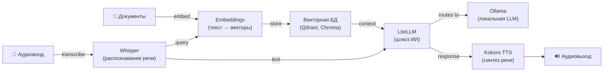

[English](README.md) | [简体中文](README-zh.md) | [繁體中文](README-zh-Hant.md) | [Русский](README-ru.md)

# Ollama на Docker

[](https://github.com/hwdsl2/docker-ollama/actions/workflows/main.yml) &nbsp;[](https://opensource.org/licenses/MIT)

Docker-образ для запуска локального LLM-сервера [Ollama](https://github.com/ollama/ollama). Предоставляет совместимый с OpenAI API для запуска больших языковых моделей локально. Основан на Debian Trixie (slim). Разработан для простоты, конфиденциальности и безопасности по умолчанию.

**Возможности:**

- **Безопасность по умолчанию** — все API-запросы требуют Bearer Token (автоматически генерируется при первом запуске)
- Автоматически генерирует API-ключ при первом запуске, сохраняя его в постоянном томе
- Предварительная загрузка моделей при первом запуске через переменную `OLLAMA_MODELS`
- Управление моделями через вспомогательный скрипт (`ollama_manage`)
- Совместимый с OpenAI API — укажите любой OpenAI SDK или приложение на ваш локальный сервер, изменив одну строку
- Обратный прокси Caddy обеспечивает аутентификацию Bearer Token для всех API-запросов (кроме `/` для проверки работоспособности)
- Ускорение на GPU NVIDIA (CUDA) для более быстрого инференса (тег образа `:cuda`)
- Автоматическая сборка и публикация через [GitHub Actions](https://github.com/hwdsl2/docker-ollama/actions/workflows/main.yml)
- Постоянное хранение моделей через Docker-том
- Лёгкий образ (~70 МБ); мультиархитектурный: `linux/amd64`, `linux/arm64`

**Также доступно:**

- ИИ/Аудио: [Whisper (STT)](https://github.com/hwdsl2/docker-whisper/blob/main/README-ru.md), [Kokoro (TTS)](https://github.com/hwdsl2/docker-kokoro/blob/main/README-ru.md), [Embeddings](https://github.com/hwdsl2/docker-embeddings/blob/main/README-ru.md), [LiteLLM](https://github.com/hwdsl2/docker-litellm/blob/main/README-ru.md)
- VPN: [WireGuard](https://github.com/hwdsl2/docker-wireguard/blob/main/README-ru.md), [OpenVPN](https://github.com/hwdsl2/docker-openvpn/blob/main/README-ru.md), [IPsec VPN](https://github.com/hwdsl2/docker-ipsec-vpn-server/blob/master/README-ru.md), [Headscale](https://github.com/hwdsl2/docker-headscale/blob/main/README-ru.md)
- Инструменты: [MCP Gateway](https://github.com/hwdsl2/docker-mcp-gateway/blob/main/README-ru.md)

**Совет:** Ollama, LiteLLM, Whisper, Kokoro, Embeddings и MCP-шлюз можно [использовать совместно](#использование-с-другими-сервисами-ии) для создания полного приватного стека ИИ на вашем сервере.

## Замечание по безопасности

Около 175 000 серверов Ollama были обнаружены публично доступными без аутентификации ([источник](https://www.sentinelone.com/labs/silent-brothers-ollama-hosts-form-anonymous-ai-network-beyond-platform-guardrails/)). Стандартная установка Ollama по умолчанию привязывается ко всем интерфейсам без аутентификации. Этот образ через встроенный прокси аутентификации обеспечивает **аутентификацию Bearer Token для всех API-запросов**, поэтому даже при случайном открытии порта несанкционированный доступ будет заблокирован.

## Быстрый старт

**Шаг 1.** Запустите сервер Ollama:

```bash
docker run \
    --name ollama \
    --restart=always \
    -v ollama-data:/var/lib/ollama \
    -p 11434:11434/tcp \
    -d hwdsl2/ollama-server
```

При первом запуске автоматически генерируется API-ключ, который отображается в логах контейнера. Все API-запросы требуют этот ключ.

**Примечание:** Для развёртывания с доступом из интернета настоятельно **рекомендуется** использовать [обратный прокси](#использование-обратного-прокси) для добавления HTTPS. В этом случае также замените `-p 11434:11434/tcp` на `-p 127.0.0.1:11434:11434/tcp` в команде `docker run` выше, чтобы предотвратить прямой доступ к незашифрованному порту.

**Шаг 2.** Получите API-ключ:

```bash
# Просмотр ключа в логах контейнера
docker logs ollama

# Или получение ключа для использования в скриптах
API_KEY=$(docker exec ollama ollama_manage --getkey)
```

API-ключ отображается в рамке с надписью **Ollama API key**. Чтобы отобразить его снова в любое время:

```bash
docker exec ollama ollama_manage --showkey
```

**Шаг 3.** Загрузите модель:

```bash
docker exec ollama ollama_manage --pull llama3.2:3b
```

**Совет:** Чтобы автоматически загрузить одну или несколько моделей при первом запуске, задайте `OLLAMA_MODELS` перед запуском контейнера:

```bash
docker run \
    --name ollama \
    --restart=always \
    -v ollama-data:/var/lib/ollama \
    -p 11434:11434/tcp \
    -e OLLAMA_MODELS=llama3.2:3b \
    -d hwdsl2/ollama-server
```

Или добавьте `OLLAMA_MODELS=llama3.2:3b` в файл `ollama.env` (см. [Переменные окружения](#переменные-окружения)).

**Шаг 4.** Протестируйте API:

```bash
API_KEY=$(docker exec ollama ollama_manage --getkey)

# Список моделей
curl http://localhost:11434/api/tags \
  -H "Authorization: Bearer $API_KEY"

# Чат (потоковый вывод)
curl http://localhost:11434/api/chat \
  -H "Content-Type: application/json" \
  -H "Authorization: Bearer $API_KEY" \
  -d '{"model": "llama3.2:3b", "messages": [{"role": "user", "content": "Привет!"}]}'
```

**Примечание:** Команды управления через `docker exec` (`ollama_manage`) не требуют API-ключа.

Чтобы узнать больше об использовании этого образа, читайте разделы ниже.

## Требования

- Сервер Linux (локальный или облачный) с установленным Docker
- Достаточно места на диске для моделей (3B модели ≈ 2 ГБ, 7B модели ≈ 4–5 ГБ, 14B+ модели ≈ 8–10 ГБ+)
- Достаточно оперативной памяти для запуска моделей (3B модели ≈ 2–4 ГБ, 7B модели ≈ 6–8 ГБ, 14B+ модели ≈ 12–16 ГБ+)
- TCP-порт 11434 (или настроенный вами) должен быть доступен

**Для ускорения на GPU (образ `:cuda`):**

- NVIDIA GPU с поддержкой CUDA
- [Драйвер NVIDIA](https://www.nvidia.com/en-us/drivers/) установлен на хосте
- Установленный [NVIDIA Container Toolkit](https://docs.nvidia.com/datacenter/cloud-native/container-toolkit/install-guide.html)
- Образ `:cuda` поддерживает только `linux/amd64`

## Загрузка

Получите доверенную сборку из [реестра Docker Hub](https://hub.docker.com/r/hwdsl2/ollama-server/):

```bash
docker pull hwdsl2/ollama-server
```

Версия с поддержкой GPU:

```bash
docker pull hwdsl2/ollama-server:cuda
```

Или загрузите с [Quay.io](https://quay.io/repository/hwdsl2/ollama-server):

```bash
docker pull quay.io/hwdsl2/ollama-server
docker image tag quay.io/hwdsl2/ollama-server hwdsl2/ollama-server
```

Поддерживаемые платформы: `linux/amd64` и `linux/arm64`. Тег `:cuda` поддерживает только `linux/amd64`.

## Переменные окружения

Все переменные являются необязательными. Если они не установлены, автоматически используются безопасные значения по умолчанию.

Этот Docker-образ использует следующие переменные, которые можно объявить в файле `env` (см. [пример](ollama.env.example)):

| Переменная | Описание | По умолчанию |
|---|---|---|
| `OLLAMA_API_KEY` | API-ключ для аутентификации запросов (автогенерируется, если не задан) | Автогенерируется |
| `OLLAMA_PORT` | TCP-порт API (1–65535) | `11434` |
| `OLLAMA_HOST` | Имя хоста или IP, отображаемые в информации о запуске и выводе `--showkey` | Автоопределяется |
| `OLLAMA_DEBUG` | Установите `1` для включения подробного отладочного логирования | *(не задано)* |
| `OLLAMA_MODELS` | Модели для загрузки при первом запуске (через запятую), напр. `llama3.2:3b,qwen2.5:7b` | *(не задано)* |
| `OLLAMA_MAX_LOADED_MODELS` | Максимум моделей, одновременно загруженных в память | *(по умолчанию Ollama)* |
| `OLLAMA_NUM_PARALLEL` | Количество параллельных слотов запросов на модель | *(по умолчанию Ollama)* |
| `OLLAMA_CONTEXT_LENGTH` | Размер контекстного окна по умолчанию (в токенах) | *(по умолчанию Ollama)* |

**Примечание:** В файле `env` значения можно заключать в одинарные кавычки, например `VAR='value'`. Не добавляйте пробелы вокруг `=`. Если вы изменили `OLLAMA_PORT`, обновите флаг `-p` в команде `docker run` соответственно.

Пример использования файла `env`:

```bash
cp ollama.env.example ollama.env
# Отредактируйте ollama.env и установите значения, затем:
docker run \
    --name ollama \
    --restart=always \
    -v ollama-data:/var/lib/ollama \
    -v ./ollama.env:/ollama.env:ro \
    -p 11434:11434/tcp \
    -d hwdsl2/ollama-server
```

## Управление моделями

Используйте `docker exec` для управления моделями с помощью вспомогательного скрипта `ollama_manage`. Модели хранятся в Docker-томе и сохраняются при перезапуске контейнера.

**Список загруженных моделей:**

```bash
docker exec ollama ollama_manage --listmodels
```

**Загрузка модели:**

```bash
# Небольшие, быстрые модели (рекомендуется для начала)
docker exec ollama ollama_manage --pull llama3.2:3b
docker exec ollama ollama_manage --pull qwen2.5:7b

# Крупные модели (требуют больше ОЗУ/VRAM)
docker exec ollama ollama_manage --pull mistral:7b
docker exec ollama ollama_manage --pull phi4:14b
docker exec ollama ollama_manage --pull gemma3:12b
```

**Удаление модели:**

```bash
docker exec ollama ollama_manage --remove llama3.2:3b
```

**Статус запущенных моделей и использование памяти:**

```bash
docker exec ollama ollama_manage --status
```

**Обновление всех моделей** (повторная загрузка последних версий):

```bash
docker exec ollama ollama_manage --update
```

**Показать API-ключ:**

```bash
docker exec ollama ollama_manage --showkey
```

**Получить API-ключ** (машиночитаемый формат, для скриптов):

```bash
API_KEY=$(docker exec ollama ollama_manage --getkey)
```

**Загрузка моделей при первом запуске** — используйте переменную `OLLAMA_MODELS` в файле `env`:

```
OLLAMA_MODELS=llama3.2:3b,qwen2.5:7b
```

## Использование API

Все API-запросы требуют Bearer Token. Сначала получите API-ключ:

```bash
API_KEY=$(docker exec ollama ollama_manage --getkey)
```

**API Ollama:**

```bash
# Список моделей
curl http://localhost:11434/api/tags \
  -H "Authorization: Bearer $API_KEY"

# Генерация (потоковый вывод)
curl http://localhost:11434/api/generate \
  -H "Content-Type: application/json" \
  -H "Authorization: Bearer $API_KEY" \
  -d '{"model": "llama3.2:3b", "prompt": "Почему небо голубое?"}'

# Чат (потоковый вывод)
curl http://localhost:11434/api/chat \
  -H "Content-Type: application/json" \
  -H "Authorization: Bearer $API_KEY" \
  -d '{"model": "llama3.2:3b", "messages": [{"role": "user", "content": "Привет!"}]}'
```

**API, совместимый с OpenAI** (работает с любым OpenAI SDK или приложением):

```bash
curl http://localhost:11434/v1/chat/completions \
  -H "Content-Type: application/json" \
  -H "Authorization: Bearer $API_KEY" \
  -d '{"model": "llama3.2:3b", "messages": [{"role": "user", "content": "Привет!"}]}'
```

**Python (OpenAI SDK):**

```python
from openai import OpenAI

client = OpenAI(
    api_key="<ваш-api-ключ>",
    base_url="http://localhost:11434/v1",
)

response = client.chat.completions.create(
    model="llama3.2:3b",
    messages=[{"role": "user", "content": "Привет!"}],
)
print(response.choices[0].message.content)
```

## Постоянное хранение данных

Все данные сервера хранятся в Docker-томе (`/var/lib/ollama` внутри контейнера):

```
/var/lib/ollama/
├── models/           # Загруженные файлы моделей
├── .api_key          # API-ключ (автогенерируется или синхронизируется из OLLAMA_API_KEY)
├── .initialized      # Маркер первого запуска
├── .port             # Сохранённый порт (используется ollama_manage)
├── .server_addr      # Кэшированный адрес сервера (используется ollama_manage --showkey)
└── .Caddyfile        # Сгенерированная конфигурация Caddy (прокси аутентификации)
```

Создавайте резервные копии Docker-тома для сохранения моделей и API-ключа.

## Использование docker-compose

```bash
cp ollama.env.example ollama.env
# Отредактируйте ollama.env и установите значения, затем:
docker compose up -d
docker logs ollama
```

Пример `docker-compose.yml` (уже включён):

```yaml
services:
  ollama:
    image: hwdsl2/ollama-server
    container_name: ollama
    restart: always
    ports:
      - "11434:11434/tcp"
    volumes:
      - ollama-data:/var/lib/ollama
      - ./ollama.env:/ollama.env:ro

volumes:
  ollama-data:
```

**Примечание:** Для развёртывания с доступом из интернета настоятельно **рекомендуется** использовать [обратный прокси](#использование-обратного-прокси) для добавления HTTPS. В этом случае также замените `"11434:11434/tcp"` на `"127.0.0.1:11434:11434/tcp"` в файле `docker-compose.yml`, чтобы предотвратить прямой доступ к незашифрованному порту.

### GPU-ускорение (CUDA)

Используйте `docker-compose.cuda.yml` для запуска с поддержкой NVIDIA GPU:

```bash
docker compose -f docker-compose.cuda.yml up -d
```

**Требования:** NVIDIA GPU и установленный на хосте [NVIDIA Container Toolkit](https://docs.nvidia.com/datacenter/cloud-native/container-toolkit/install-guide.html). Образ `:cuda` поддерживает только `linux/amd64`.

## Использование обратного прокси

Для развёртывания с выходом в интернет разместите обратный прокси перед Ollama для обработки HTTPS-терминации. Сервер работает без HTTPS в локальной или доверенной сети, но HTTPS рекомендуется при открытом доступе к API-эндпоинту из интернета.

Используйте один из следующих адресов для доступа к контейнеру Ollama из обратного прокси:

- **`ollama:11434`** — если ваш обратный прокси работает как контейнер в **той же Docker-сети**, что и Ollama (например, определён в том же `docker-compose.yml`).
- **`127.0.0.1:11434`** — если ваш обратный прокси работает **на хосте** и порт `11434` опубликован (по умолчанию `docker-compose.yml` публикует его).

**Примечание:** Заголовок `Authorization: Bearer` автоматически передаётся через обратные прокси — специальная настройка не требуется.

**Пример с [Caddy](https://caddyserver.com/docs/) ([Docker-образ](https://hub.docker.com/_/caddy))** (автоматический TLS через Let's Encrypt, обратный прокси в той же Docker-сети):

`Caddyfile`:
```
ollama.example.com {
  reverse_proxy ollama:11434
}
```

**Пример с nginx** (обратный прокси на хосте):

```nginx
server {
    listen 443 ssl;
    server_name ollama.example.com;

    ssl_certificate     /path/to/cert.pem;
    ssl_certificate_key /path/to/key.pem;

    location / {
        proxy_pass         http://127.0.0.1:11434;
        proxy_set_header   Host $host;
        proxy_set_header   X-Real-IP $remote_addr;
        proxy_set_header   X-Forwarded-For $proxy_add_x_forwarded_for;
        proxy_set_header   X-Forwarded-Proto $scheme;
        proxy_http_version 1.1;       # требуется для потоковых ответов
        proxy_read_timeout 300s;
        proxy_buffering    off;
    }
}
```

После настройки обратного прокси установите `OLLAMA_HOST=ollama.example.com` в файле `env`, чтобы в логах запуска и выводе `ollama_manage --showkey` отображался правильный URL эндпоинта.

## Обновление Docker-образа

Для обновления Docker-образа и контейнера:

```bash
docker pull hwdsl2/ollama-server
docker rm -f ollama
# Затем повторно выполните команду docker run из раздела «Быстрый старт» с тем же томом.
```

Загруженные модели сохраняются в томе `ollama-data`.

## Использование с другими сервисами ИИ

Образы [Ollama (LLM)](https://github.com/hwdsl2/docker-ollama/blob/main/README-ru.md), [LiteLLM](https://github.com/hwdsl2/docker-litellm/blob/main/README-ru.md), [Whisper (STT)](https://github.com/hwdsl2/docker-whisper/blob/main/README-ru.md), [Kokoro (TTS)](https://github.com/hwdsl2/docker-kokoro/blob/main/README-ru.md), [Embeddings](https://github.com/hwdsl2/docker-embeddings/blob/main/README-ru.md) и [MCP-шлюз](https://github.com/hwdsl2/docker-mcp-gateway/blob/main/README-ru.md) можно объединить для создания полного приватного стека ИИ на вашем сервере — от голосового ввода/вывода до RAG-ответов на вопросы. Whisper, Kokoro и Embeddings работают полностью локально. Ollama выполняет весь инференс LLM локально, данные не отправляются третьим сторонам. При использовании LiteLLM с внешними провайдерами (например, OpenAI, Anthropic) ваши данные будут отправлены этим провайдерам.



| Сервис | Роль | Порт по умолчанию |
|---|---|---|
| **[Ollama (LLM)](https://github.com/hwdsl2/docker-ollama)** | Запускает локальные LLM-модели (llama3, qwen, mistral и др.) | `11434` |
| **[LiteLLM](https://github.com/hwdsl2/docker-litellm)** | Шлюз ИИ — маршрутизирует запросы к Ollama, OpenAI, Anthropic и 100+ провайдерам | `4000` |
| **[Embeddings](https://github.com/hwdsl2/docker-embeddings)** | Преобразует текст в векторы для семантического поиска и RAG | `8000` |
| **[Whisper (распознавание речи)](https://github.com/hwdsl2/docker-whisper)** | Транскрибирует речь в текст | `9000` |
| **[Kokoro (синтез речи)](https://github.com/hwdsl2/docker-kokoro)** | Преобразует текст в естественную речь | `8880` |
| **[MCP-шлюз](https://github.com/hwdsl2/docker-mcp-gateway/blob/main/README-ru.md)** | Предоставляет сервисы ИИ как MCP-инструменты для ИИ-ассистентов (Claude, Cursor и др.) | `3000` |

**Подключение Ollama к LiteLLM:**

```bash
# В docker-litellm добавьте Ollama как провайдера моделей:
docker exec litellm litellm_manage \
  --addmodel ollama/llama3.2:3b \
  --base-url http://ollama:11434
```

<details>
<summary><strong>Пример голосового конвейера</strong></summary>

Транскрибируйте заданный голосом вопрос, получите ответ от локальной LLM через Ollama и преобразуйте его в речь:

```bash
OLLAMA_KEY=$(docker exec ollama ollama_manage --getkey)
LITELLM_KEY=$(docker exec litellm litellm_manage --getkey)

# Шаг 1: Транскрибируйте аудио в текст (Whisper)
TEXT=$(curl -s http://localhost:9000/v1/audio/transcriptions \
    -F file=@question.mp3 -F model=whisper-1 | jq -r .text)

# Шаг 2: Отправьте текст в Ollama через LiteLLM и получите ответ
RESPONSE=$(curl -s http://localhost:4000/v1/chat/completions \
    -H "Authorization: Bearer $LITELLM_KEY" \
    -H "Content-Type: application/json" \
    -d "{\"model\":\"ollama/llama3.2:3b\",\"messages\":[{\"role\":\"user\",\"content\":\"$TEXT\"}]}" \
    | jq -r '.choices[0].message.content')

# Шаг 3: Преобразуйте ответ в речь (Kokoro TTS)
curl -s http://localhost:8880/v1/audio/speech \
    -H "Content-Type: application/json" \
    -d "{\"model\":\"tts-1\",\"input\":\"$RESPONSE\",\"voice\":\"af_heart\"}" \
    --output response.mp3
```

</details>

<details>
<summary><strong>Пример RAG-конвейера</strong></summary>

Создайте эмбеддинги документов для семантического поиска, извлеките контекст, затем ответьте на вопросы с помощью локальной модели Ollama:

```bash
OLLAMA_KEY=$(docker exec ollama ollama_manage --getkey)
LITELLM_KEY=$(docker exec litellm litellm_manage --getkey)

# Шаг 1: Создайте эмбеддинг фрагмента документа и сохраните вектор в векторную БД
curl -s http://localhost:8000/v1/embeddings \
    -H "Content-Type: application/json" \
    -d '{"input": "Docker упрощает развёртывание, упаковывая приложения в контейнеры.", "model": "text-embedding-ada-002"}' \
    | jq '.data[0].embedding'
# → Сохраните возвращённый вектор вместе с исходным текстом в Qdrant, Chroma, pgvector и т.д.

# Шаг 2: При запросе создайте эмбеддинг вопроса, извлеките наиболее подходящие
#          фрагменты из векторной БД, затем отправьте вопрос и контекст в Ollama через LiteLLM.
curl -s http://localhost:4000/v1/chat/completions \
    -H "Authorization: Bearer $LITELLM_KEY" \
    -H "Content-Type: application/json" \
    -d '{
      "model": "ollama/llama3.2:3b",
      "messages": [
        {"role": "system", "content": "Отвечайте только на основе предоставленного контекста."},
        {"role": "user", "content": "Что делает Docker?\n\nКонтекст: Docker упрощает развёртывание, упаковывая приложения в контейнеры."}
      ]
    }' \
    | jq -r '.choices[0].message.content'
```

</details>

<details>
<summary><strong>Пример docker-compose для полного стека</strong></summary>

Разверните все сервисы одной командой. Настройка не требуется — все сервисы автоматически конфигурируются с безопасными значениями по умолчанию при первом запуске.

**Требования к ресурсам:** Для одновременной работы всех сервисов требуется не менее 8 ГБ ОЗУ (с небольшими моделями). Для крупных моделей LLM (8B+) рекомендуется 32 ГБ и более. Вы можете закомментировать ненужные сервисы для экономии памяти.

```yaml
services:
  ollama:
    image: hwdsl2/ollama-server
    container_name: ollama
    restart: always
    # ports:
    #   - "11434:11434/tcp"  # Раскомментируйте для прямого доступа к Ollama
    volumes:
      - ollama-data:/var/lib/ollama
      # - ./ollama.env:/ollama.env:ro  # optional: custom config

  litellm:
    image: hwdsl2/litellm-server
    container_name: litellm
    restart: always
    ports:
      - "4000:4000/tcp"
    environment:
      - LITELLM_OLLAMA_BASE_URL=http://ollama:11434
    volumes:
      - litellm-data:/etc/litellm
      # - ./litellm.env:/litellm.env:ro  # optional: custom config

  embeddings:
    image: hwdsl2/embeddings-server
    container_name: embeddings
    restart: always
    ports:
      - "8000:8000/tcp"
    volumes:
      - embeddings-data:/var/lib/embeddings
      # - ./embed.env:/embed.env:ro  # optional: custom config

  whisper:
    image: hwdsl2/whisper-server
    container_name: whisper
    restart: always
    ports:
      - "9000:9000/tcp"
    volumes:
      - whisper-data:/var/lib/whisper
      # - ./whisper.env:/whisper.env:ro  # optional: custom config

  kokoro:
    image: hwdsl2/kokoro-server
    container_name: kokoro
    restart: always
    ports:
      - "8880:8880/tcp"
    volumes:
      - kokoro-data:/var/lib/kokoro
      # - ./kokoro.env:/kokoro.env:ro  # optional: custom config

  mcp:
    image: hwdsl2/mcp-gateway
    container_name: mcp
    restart: always
    ports:
      - "3000:3000/tcp"
    volumes:
      - mcp-data:/var/lib/mcp
      # - ./mcp.env:/mcp.env:ro  # optional: custom config

volumes:
  ollama-data:
  litellm-data:
  embeddings-data:
  whisper-data:
  kokoro-data:
  mcp-data:
```

Для ускорения на NVIDIA GPU измените теги образов на `:cuda` для ollama, whisper и kokoro, и добавьте следующее к каждому из этих сервисов:

```yaml
    deploy:
      resources:
        reservations:
          devices:
            - driver: nvidia
              count: 1
              capabilities: [gpu]
```

</details>

## Технические подробности

- Базовый образ: `debian:trixie-slim` (CPU) / `nvidia/cuda:12.9.1-base-ubuntu24.04` (CUDA)
- Размер образа: ~70 МБ (CPU) / ~3.2 ГБ (CUDA)
- Ollama: последняя версия, установлена как статический бинарный файл
- Прокси аутентификации: [Caddy](https://caddyserver.com) (всегда активен, обеспечивает аутентификацию Bearer Token)
- Каталог данных: `/var/lib/ollama` (Docker-том)
- Хранилище моделей: `/var/lib/ollama/models` внутри тома
- API Ollama: `http://localhost:11434` (или настроенный вами порт)
- OpenAI-совместимый API: `http://localhost:11434/v1`

## Лицензия

**Примечание:** Программные компоненты внутри готового образа (такие как Ollama, Caddy и их зависимости) распространяются под лицензиями, выбранными их авторами. При использовании готового образа ответственность за соответствие лицензиям всего содержащегося в нём программного обеспечения лежит на пользователе образа.

Copyright (C) 2026 Lin Song   
Настоящая работа распространяется под [лицензией MIT](https://opensource.org/licenses/MIT).

**Ollama** является собственностью (C) 2023 Ollama и распространяется под [лицензией MIT](https://github.com/ollama/ollama/blob/main/LICENSE).

**Caddy** является собственностью (C) 2015 Matthew Holt и авторов Caddy, и распространяется под [лицензией Apache 2.0](https://github.com/caddyserver/caddy/blob/master/LICENSE).

Этот проект представляет собой независимую Docker-конфигурацию для Ollama и не связан с Ollama, не одобрен и не спонсируется ею.