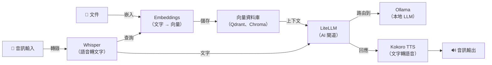

[English](README.md) | [简体中文](README-zh.md) | [繁體中文](README-zh-Hant.md) | [Русский](README-ru.md)

# Docker 上的 Ollama

[](https://github.com/hwdsl2/docker-ollama/actions/workflows/main.yml) &nbsp;[](https://opensource.org/licenses/MIT)

用於執行 [Ollama](https://github.com/ollama/ollama) 本地大型語言模型伺服器的 Docker 映像。提供與 OpenAI 相容的 API，可在本地執行大型語言模型。基於 Debian Trixie（slim）。設計簡單、私密，並預設安全。

**功能特色：**

- **預設安全** — 所有 API 請求均需 Bearer Token（首次啟動時自動產生）
- 首次啟動時自動產生 API 金鑰，並儲存在持久化卷中
- 透過 `OLLAMA_MODELS` 環境變數在首次啟動時預先拉取模型
- 透過輔助腳本（`ollama_manage`）管理模型
- 與 OpenAI 相容的 API — 只需修改一行即可將任何 OpenAI SDK 或應用程式指向本地伺服器
- Caddy 反向代理對所有 API 請求強制執行 Bearer Token 驗證（`/` 健康檢查除外）
- 透過同系列 CUDA 映像（`hwdsl2/ollama-server:cuda`）支援 GPU 加速
- 透過 [GitHub Actions](https://github.com/hwdsl2/docker-ollama/actions/workflows/main.yml) 自動建置和發布
- 透過 Docker 卷持久化儲存模型資料
- 多架構：`linux/amd64`、`linux/arm64`

**另提供：**

- AI/音訊：[Whisper (STT)](https://github.com/hwdsl2/docker-whisper/blob/main/README-zh-Hant.md)、[Kokoro (TTS)](https://github.com/hwdsl2/docker-kokoro/blob/main/README-zh-Hant.md)、[Embeddings](https://github.com/hwdsl2/docker-embeddings/blob/main/README-zh-Hant.md)、[LiteLLM](https://github.com/hwdsl2/docker-litellm/blob/main/README-zh-Hant.md)
- VPN：[WireGuard](https://github.com/hwdsl2/docker-wireguard/blob/main/README-zh-Hant.md)、[OpenVPN](https://github.com/hwdsl2/docker-openvpn/blob/main/README-zh-Hant.md)、[IPsec VPN](https://github.com/hwdsl2/docker-ipsec-vpn-server/blob/master/README-zh-Hant.md)、[Headscale](https://github.com/hwdsl2/docker-headscale/blob/main/README-zh-Hant.md)

**提示：** Ollama、LiteLLM、Whisper、Kokoro 和 Embeddings 可以[協同使用](#與其他-ai-服務配合使用)，在您自己的伺服器上建置完整的私有 AI 技術堆疊。

## 安全說明

> 2026 年發現約 175,000 台 Ollama 伺服器在未經驗證的情況下公開暴露。裸裝的 Ollama 預設綁定到所有介面且無驗證。本映像有所不同：**所有 API 請求均需 Bearer Token**（未設定時自動產生）。內建的 Caddy 驗證代理強制執行驗證，即使連接埠意外暴露到網際網路，未授權存取也會被阻止。

## 快速開始

**第一步。** 啟動 Ollama 伺服器：

```bash
docker run \
    --name ollama \
    --restart=always \
    -v ollama-data:/var/lib/ollama \
    -p 11434:11434/tcp \
    -d hwdsl2/ollama-server
```

首次啟動時，系統會自動產生 API 金鑰並顯示在容器日誌中。所有 API 請求均需此金鑰。

**注意：** 對於需要 HTTPS 的面向網際網路部署，請參閱[使用反向代理](#使用反向代理)。

**第二步。** 取得 API 金鑰：

```bash
# 在容器日誌中查看金鑰
docker logs ollama

# 或取得金鑰以在腳本中使用
API_KEY=$(docker exec ollama ollama_manage --getkey)
```

API 金鑰顯示在標有 **Ollama API key** 的方框中。隨時可以透過以下指令重新顯示：

```bash
docker exec ollama ollama_manage --showkey
```

**第三步。** 拉取模型：

```bash
docker exec ollama ollama_manage --pull llama3.2:3b
```

**提示：** 要在首次啟動時自動拉取一個或多個模型，可在執行容器前設定 `OLLAMA_MODELS`：

```bash
docker run \
    --name ollama \
    --restart=always \
    -v ollama-data:/var/lib/ollama \
    -p 11434:11434/tcp \
    -e OLLAMA_MODELS=llama3.2:3b \
    -d hwdsl2/ollama-server
```

或在 `ollama.env` 檔案中新增 `OLLAMA_MODELS=llama3.2:3b`（參見[環境變數](#環境變數)）。

**第四步。** 透過 API 測試：

```bash
API_KEY=$(docker exec ollama ollama_manage --getkey)

# 列出模型
curl http://localhost:11434/api/tags \
  -H "Authorization: Bearer $API_KEY"

# 對話補全（串流）
curl http://localhost:11434/api/chat \
  -H "Content-Type: application/json" \
  -H "Authorization: Bearer $API_KEY" \
  -d '{"model": "llama3.2:3b", "messages": [{"role": "user", "content": "你好！"}]}'
```

**注意：** `docker exec` 管理指令（`ollama_manage`）不需要 API 金鑰。

要了解有關如何使用此映像的更多資訊，請閱讀以下各節。

## 系統需求

- 已安裝 Docker 的 Linux 伺服器（本地或雲端）
- 足夠的磁碟空間用於儲存模型（3B 模型 ≈ 2GB，7B 模型 ≈ 4–5GB，14B+ 模型 ≈ 8–10GB+）
- 如需 GPU 加速：支援 CUDA 的 NVIDIA GPU 以及 [NVIDIA Container Toolkit](https://docs.nvidia.com/datacenter/cloud-native/container-toolkit/install-guide.html)
- TCP 連接埠 11434（或您設定的連接埠）需可存取

## 下載

從 [Docker Hub 映像倉庫](https://hub.docker.com/r/hwdsl2/ollama-server/)取得可信建置版本：

```bash
docker pull hwdsl2/ollama-server
```

GPU 支援版本：

```bash
docker pull hwdsl2/ollama-server:cuda
```

或者從 [Quay.io](https://quay.io/repository/hwdsl2/ollama-server) 下載：

```bash
docker pull quay.io/hwdsl2/ollama-server
docker image tag quay.io/hwdsl2/ollama-server hwdsl2/ollama-server
```

支援平台：`linux/amd64` 和 `linux/arm64`。

## 環境變數

所有變數均為可選。如果未設定，將自動使用安全預設值。

此 Docker 映像使用以下變數，可在 `env` 檔案中宣告（參見[範例](ollama.env.example)）：

| 變數 | 說明 | 預設值 |
|---|---|---|
| `OLLAMA_API_KEY` | 用於驗證請求的 API 金鑰（未設定時自動產生） | 自動產生 |
| `OLLAMA_PORT` | API 的 TCP 連接埠（1–65535） | `11434` |
| `OLLAMA_HOST` | 在啟動資訊和 `--showkey` 輸出中顯示的主機名稱或 IP | 自動偵測 |
| `OLLAMA_DEBUG` | 設定為 `1` 以啟用詳細除錯日誌 | *(未設定)* |
| `OLLAMA_MODELS` | 首次啟動時拉取的模型（逗號分隔），例如 `llama3.2:3b,qwen2.5:7b` | *(未設定)* |
| `OLLAMA_MAX_LOADED_MODELS` | 同時保持載入在記憶體中的最大模型數 | *(Ollama 預設)* |
| `OLLAMA_NUM_PARALLEL` | 每個模型的並行請求槽數 | *(Ollama 預設)* |
| `OLLAMA_CONTEXT_LENGTH` | 預設上下文視窗大小（token 數） | *(Ollama 預設)* |

**注意：** 在 `env` 檔案中，您可以將值用單引號括起來，例如 `VAR='value'`。不要在 `=` 兩側新增空格。如果您更改了 `OLLAMA_PORT`，請相應地更新 `docker run` 指令中的 `-p` 旗標。

使用 `env` 檔案的範例：

```bash
cp ollama.env.example ollama.env
# 編輯 ollama.env 並設定您的值，然後：
docker run \
    --name ollama \
    --restart=always \
    -v ollama-data:/var/lib/ollama \
    -v ./ollama.env:/ollama.env:ro \
    -p 11434:11434/tcp \
    -d hwdsl2/ollama-server
```

## 模型管理

使用 `docker exec` 透過 `ollama_manage` 輔助腳本管理模型。模型儲存在 Docker 卷中，在容器重啟後仍然保留。

**列出已下載的模型：**

```bash
docker exec ollama ollama_manage --listmodels
```

**拉取模型：**

```bash
# 小型、快速的模型（推薦入門使用）
docker exec ollama ollama_manage --pull llama3.2:3b
docker exec ollama ollama_manage --pull qwen2.5:7b

# 大型模型（需要更多記憶體/視訊記憶體）
docker exec ollama ollama_manage --pull mistral:7b
docker exec ollama ollama_manage --pull phi4:14b
docker exec ollama ollama_manage --pull gemma3:12b
```

**刪除模型：**

```bash
docker exec ollama ollama_manage --remove llama3.2:3b
```

**顯示執行中的模型和記憶體使用情況：**

```bash
docker exec ollama ollama_manage --status
```

**更新所有模型**（重新拉取最新版本）：

```bash
docker exec ollama ollama_manage --update
```

**顯示 API 金鑰：**

```bash
docker exec ollama ollama_manage --showkey
```

**取得 API 金鑰**（機器可讀，用於腳本）：

```bash
API_KEY=$(docker exec ollama ollama_manage --getkey)
```

**在首次啟動時拉取模型**，在 `env` 檔案中使用 `OLLAMA_MODELS` 變數：

```
OLLAMA_MODELS=llama3.2:3b,qwen2.5:7b
```

## 使用 API

所有 API 請求均需 Bearer Token。首先取得 API 金鑰：

```bash
API_KEY=$(docker exec ollama ollama_manage --getkey)
```

**Ollama API：**

```bash
# 列出模型
curl http://localhost:11434/api/tags \
  -H "Authorization: Bearer $API_KEY"

# 生成（串流）
curl http://localhost:11434/api/generate \
  -H "Content-Type: application/json" \
  -H "Authorization: Bearer $API_KEY" \
  -d '{"model": "llama3.2:3b", "prompt": "天空為什麼是藍色的？"}'

# 對話補全（串流）
curl http://localhost:11434/api/chat \
  -H "Content-Type: application/json" \
  -H "Authorization: Bearer $API_KEY" \
  -d '{"model": "llama3.2:3b", "messages": [{"role": "user", "content": "你好！"}]}'
```

**OpenAI 相容 API**（適用於任何 OpenAI SDK 或應用程式）：

```bash
curl http://localhost:11434/v1/chat/completions \
  -H "Content-Type: application/json" \
  -H "Authorization: Bearer $API_KEY" \
  -d '{"model": "llama3.2:3b", "messages": [{"role": "user", "content": "你好！"}]}'
```

**Python（OpenAI SDK）：**

```python
from openai import OpenAI

client = OpenAI(
    api_key="<你的API金鑰>",
    base_url="http://localhost:11434/v1",
)

response = client.chat.completions.create(
    model="llama3.2:3b",
    messages=[{"role": "user", "content": "你好！"}],
)
print(response.choices[0].message.content)
```

## 持久化資料

所有伺服器資料儲存在 Docker 卷中（容器內的 `/var/lib/ollama`）：

```
/var/lib/ollama/
├── models/           # 已下載的模型檔案
├── .api_key          # API 金鑰（自動產生，或從 OLLAMA_API_KEY 同步）
├── .initialized      # 首次執行標記
├── .port             # 儲存的連接埠（供 ollama_manage 使用）
├── .server_addr      # 快取的伺服器位址（供 ollama_manage --showkey 使用）
└── .Caddyfile        # 產生的 Caddy 設定（驗證代理）
```

備份 Docker 卷以保留您的模型和 API 金鑰。

## 使用 docker-compose

```bash
cp ollama.env.example ollama.env
# 編輯 ollama.env 並設定您的值，然後：
docker compose up -d
docker logs ollama
```

`docker-compose.yml` 範例（已包含）：

```yaml
services:
  ollama:
    image: hwdsl2/ollama-server
    container_name: ollama
    restart: always
    ports:
      - "11434:11434/tcp"
    volumes:
      - ollama-data:/var/lib/ollama
      - ./ollama.env:/ollama.env:ro

volumes:
  ollama-data:
```

### GPU 加速（CUDA）

使用 `docker-compose.cuda.yml` 以 NVIDIA GPU 支援執行：

```bash
docker compose -f docker-compose.cuda.yml up -d
```

需求：NVIDIA GPU 和 [NVIDIA Container Toolkit](https://docs.nvidia.com/datacenter/cloud-native/container-toolkit/install-guide.html)。

## 使用反向代理

對於面向網際網路的部署，在前面放置反向代理來處理 HTTPS。內建的 Caddy 驗證代理處理驗證；外部反向代理新增 TLS。使用以下位址之一存取 Ollama 容器：

- **`ollama:11434`** — 如果反向代理作為容器在同一 Docker 網路中執行
- **`127.0.0.1:11434`** — 如果反向代理在主機上執行且連接埠已發布

**注意：** `Authorization: Bearer` 標頭會自動通過反向代理傳遞，無需特殊設定。

**使用 [Caddy](https://caddyserver.com/docs/) 的範例（透過 Let's Encrypt 自動 TLS）：**

`Caddyfile`：
```
ollama.example.com {
  reverse_proxy ollama:11434
}
```

**使用 nginx 的範例（主機上的反向代理）：**

```nginx
server {
  listen 443 ssl;
  server_name ollama.example.com;

  ssl_certificate     /path/to/cert.pem;
  ssl_certificate_key /path/to/key.pem;

  location / {
    proxy_pass http://127.0.0.1:11434;
    proxy_set_header Host $host;
    proxy_set_header X-Real-IP $remote_addr;
    proxy_set_header X-Forwarded-For $proxy_add_x_forwarded_for;
    proxy_set_header X-Forwarded-Proto $scheme;
    proxy_read_timeout 300s;
    proxy_buffering off;
  }
}
```

設定反向代理後，在 `env` 檔案中設定 `OLLAMA_HOST=ollama.example.com`，以便在啟動日誌和 `ollama_manage --showkey` 輸出中顯示正確的端點 URL。

## 更新 Docker 映像

要更新 Docker 映像和容器：

```bash
docker pull hwdsl2/ollama-server
docker rm -f ollama
# 然後使用相同的卷重新執行快速開始中的 docker run 指令。
```

您下載的模型保存在 `ollama-data` 卷中。

## 與其他 AI 服務配合使用

[Ollama](https://github.com/hwdsl2/docker-ollama)、[LiteLLM](https://github.com/hwdsl2/docker-litellm)、[Whisper (STT)](https://github.com/hwdsl2/docker-whisper)、[Kokoro (TTS)](https://github.com/hwdsl2/docker-kokoro) 和 [Embeddings](https://github.com/hwdsl2/docker-embeddings) 映像可以組合在一起，在您自己的伺服器上建置完整的私有 AI 技術堆疊——從語音輸入/輸出到 RAG 問答。Ollama 在本地執行所有 LLM 推論，無需向第三方傳送資料。使用 LiteLLM 接入外部提供商（如 OpenAI、Anthropic）時，您的資料將傳送給這些提供商。



| 服務 | 作用 | 預設連接埠 |
|---|---|---|
| **[Ollama](https://github.com/hwdsl2/docker-ollama)** | 執行本地 LLM 模型（llama3、qwen、mistral 等） | `11434` |
| **[LiteLLM](https://github.com/hwdsl2/docker-litellm)** | AI 閘道 — 將請求路由到 Ollama、OpenAI、Anthropic 等 100+ 提供商 | `4000` |
| **[Embeddings](https://github.com/hwdsl2/docker-embeddings)** | 將文字轉換為向量，用於語意搜尋和 RAG | `8000` |
| **[Whisper（語音轉文字）](https://github.com/hwdsl2/docker-whisper)** | 將語音音訊轉錄為文字 | `9000` |
| **[Kokoro（文字轉語音）](https://github.com/hwdsl2/docker-kokoro)** | 將文字轉換為自然語音 | `8880` |

**將 Ollama 連接到 LiteLLM：**

```bash
# 在 docker-litellm 中，將 Ollama 新增為模型提供商：
docker exec litellm litellm_manage \
  --addmodel ollama/llama3.2:3b \
  --base-url http://ollama:11434
```

<details>
<summary><strong>語音管道範例</strong></summary>

將語音問題轉錄為文字，透過 Ollama 取得本地 LLM 回應，並轉換為語音：

```bash
OLLAMA_KEY=$(docker exec ollama ollama_manage --getkey)
LITELLM_KEY=$(docker exec litellm litellm_manage --getkey)

# 第一步：將音訊轉錄為文字（Whisper）
TEXT=$(curl -s http://localhost:9000/v1/audio/transcriptions \
    -F file=@question.mp3 -F model=whisper-1 | jq -r .text)

# 第二步：透過 LiteLLM 將文字傳送給 Ollama 並取得回應
RESPONSE=$(curl -s http://localhost:4000/v1/chat/completions \
    -H "Authorization: Bearer $LITELLM_KEY" \
    -H "Content-Type: application/json" \
    -d "{\"model\":\"ollama/llama3.2:3b\",\"messages\":[{\"role\":\"user\",\"content\":\"$TEXT\"}]}" \
    | jq -r '.choices[0].message.content')

# 第三步：將回應轉換為語音（Kokoro TTS）
curl -s http://localhost:8880/v1/audio/speech \
    -H "Content-Type: application/json" \
    -d "{\"model\":\"tts-1\",\"input\":\"$RESPONSE\",\"voice\":\"af_heart\"}" \
    --output response.mp3
```

</details>

<details>
<summary><strong>RAG 管道範例</strong></summary>

對文件進行向量化以實現語意搜尋，擷取上下文，然後用本地 Ollama 模型回答問題：

```bash
OLLAMA_KEY=$(docker exec ollama ollama_manage --getkey)
LITELLM_KEY=$(docker exec litellm litellm_manage --getkey)

# 第一步：對文件片段進行嵌入並將向量存入向量資料庫
curl -s http://localhost:8000/v1/embeddings \
    -H "Content-Type: application/json" \
    -d '{"input": "Docker 透過將應用程式打包在容器中來簡化部署。", "model": "text-embedding-ada-002"}' \
    | jq '.data[0].embedding'
# → 將返回的向量與原始文字一起存入 Qdrant、Chroma、pgvector 等。

# 第二步：查詢時，對問題進行嵌入，從向量資料庫擷取最匹配的片段，
#          然後將問題和擷取到的上下文傳送給 Ollama（透過 LiteLLM）。
curl -s http://localhost:4000/v1/chat/completions \
    -H "Authorization: Bearer $LITELLM_KEY" \
    -H "Content-Type: application/json" \
    -d '{
      "model": "ollama/llama3.2:3b",
      "messages": [
        {"role": "system", "content": "僅根據提供的上下文回答問題。"},
        {"role": "user", "content": "Docker 是做什麼的？\n\n上下文：Docker 透過將應用程式打包在容器中來簡化部署。"}
      ]
    }' \
    | jq -r '.choices[0].message.content'
```

</details>

<details>
<summary><strong>完整技術堆疊 docker-compose 範例</strong></summary>

```yaml
services:
  ollama:
    image: hwdsl2/ollama-server
    container_name: ollama
    restart: always
    volumes:
      - ollama-data:/var/lib/ollama
      - ./ollama.env:/ollama.env:ro

  litellm:
    image: hwdsl2/litellm-server
    container_name: litellm
    restart: always
    ports:
      - "127.0.0.1:4000:4000/tcp"
    volumes:
      - litellm-data:/etc/litellm
      - ./litellm.env:/litellm.env:ro

volumes:
  ollama-data:
  litellm-data:
```

</details>

## 技術細節

- 基礎映像：`debian:trixie-slim`（CPU）/ `nvidia/cuda:12.9.1-base-ubuntu24.04`（CUDA）
- 映像大小：約 75MB（CPU）/ 約 10GB（CUDA）
- Ollama：最新版本，以靜態二進位檔案安裝
- 驗證代理：[Caddy](https://caddyserver.com)（始終啟用，強制執行 Bearer Token 驗證）
- 資料目錄：`/var/lib/ollama`（Docker 卷）
- 模型儲存：卷內的 `/var/lib/ollama/models`
- Ollama API：`http://localhost:11434`（或您設定的連接埠）
- OpenAI 相容 API：`http://localhost:11434/v1`

## 授權條款

**注意：** 預建置映像中的軟體元件（如 Ollama、Caddy 及其相依套件）遵循其各自版權持有者選擇的授權條款。與任何預建置映像的使用一樣，映像使用者有責任確保對此映像的任何使用均符合其中包含的所有軟體的相關授權條款。

版權所有 (C) 2026 Lin Song   
本作品基於 [MIT 授權條款](https://opensource.org/licenses/MIT)授權。

**Ollama** 版權所有 (C) 2023 Ollama，基於 [MIT 授權條款](https://github.com/ollama/ollama/blob/main/LICENSE)分發。

**Caddy** 版權所有 (C) Matthew Holt 和 Caddy 作者，基於 [Apache 授權條款 2.0](https://github.com/caddyserver/caddy/blob/master/LICENSE) 分發。

本專案是 Ollama 的獨立 Docker 設定，與 Ollama 沒有任何關聯、背書或贊助關係。
