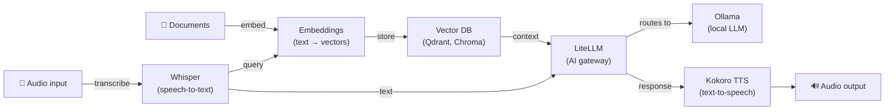

[English](README.md) | [简体中文](README-zh.md) | [繁體中文](README-zh-Hant.md) | [Русский](README-ru.md)

# Ollama on Docker

[](https://github.com/hwdsl2/docker-ollama/actions/workflows/main.yml) &nbsp;[](https://opensource.org/licenses/MIT)

Docker image to run an [Ollama](https://github.com/ollama/ollama) local LLM server. Provides an OpenAI-compatible API for running large language models locally. Based on Debian Trixie (slim). Designed to be simple, private, and secure by default.

**Features:**

- **Secure by default** — all API requests require a Bearer token (auto-generated on first start)
- Auto-generates an API key on first start, stored in the persistent volume
- First-start model pre-pull via `OLLAMA_MODELS` environment variable
- Model management via a helper script (`ollama_manage`)
- OpenAI-compatible API — point any OpenAI SDK or app at your local server with a one-line change
- Caddy reverse proxy enforces Bearer token auth on all API requests (except `/` health check)
- NVIDIA GPU (CUDA) acceleration for faster inference (`:cuda` image tag)
- Automatically built and published via [GitHub Actions](https://github.com/hwdsl2/docker-ollama/actions/workflows/main.yml)
- Persistent model storage via a Docker volume
- Lightweight image (~70MB); multi-arch: `linux/amd64`, `linux/arm64`

**Also available:**

- AI/Audio: [Whisper (STT)](https://github.com/hwdsl2/docker-whisper), [Kokoro (TTS)](https://github.com/hwdsl2/docker-kokoro), [Embeddings](https://github.com/hwdsl2/docker-embeddings), [LiteLLM](https://github.com/hwdsl2/docker-litellm)
- VPN: [WireGuard](https://github.com/hwdsl2/docker-wireguard), [OpenVPN](https://github.com/hwdsl2/docker-openvpn), [IPsec VPN](https://github.com/hwdsl2/docker-ipsec-vpn-server), [Headscale](https://github.com/hwdsl2/docker-headscale)

**Tip:** Ollama, LiteLLM, Whisper, Kokoro, and Embeddings can be [used together](#using-with-other-ai-services) to build a complete, private AI stack on your own server.

## Security note

~175,000 Ollama servers were found publicly exposed without authentication ([source](https://www.sentinelone.com/labs/silent-brothers-ollama-hosts-form-anonymous-ai-network-beyond-platform-guardrails/)). A bare Ollama install binds to all interfaces with no auth by default. This image enforces **Bearer token authentication on all API requests** via a built-in auth proxy, so unauthorized access is blocked even if the port is accidentally exposed.

## Quick start

**Step 1.** Start the Ollama server:

```bash
docker run \
    --name ollama \
    --restart=always \
    -v ollama-data:/var/lib/ollama \
    -p 11434:11434/tcp \
    -d hwdsl2/ollama-server
```

On first start, an API key is auto-generated and displayed in the container logs. All API requests require this key.

**Note:** For internet-facing deployments with HTTPS, see [Using a reverse proxy](#using-a-reverse-proxy).

**Step 2.** Get the API key:

```bash
# View the key in the container logs
docker logs ollama

# Or retrieve it for use in scripts
API_KEY=$(docker exec ollama ollama_manage --getkey)
```

The API key is displayed in a box labeled **Ollama API key**. To display it again at any time:

```bash
docker exec ollama ollama_manage --showkey
```

**Step 3.** Pull a model:

```bash
docker exec ollama ollama_manage --pull llama3.2:3b
```

**Tip:** To pull one or more models automatically on first start, set `OLLAMA_MODELS` before running the container:

```bash
docker run \
    --name ollama \
    --restart=always \
    -v ollama-data:/var/lib/ollama \
    -p 11434:11434/tcp \
    -e OLLAMA_MODELS=llama3.2:3b \
    -d hwdsl2/ollama-server
```

Or add `OLLAMA_MODELS=llama3.2:3b` to your `ollama.env` file (see [Environment variables](#environment-variables)).

**Step 4.** Test with the API:

```bash
API_KEY=$(docker exec ollama ollama_manage --getkey)

# List models
curl http://localhost:11434/api/tags \
  -H "Authorization: Bearer $API_KEY"

# Chat completion (streaming)
curl http://localhost:11434/api/chat \
  -H "Content-Type: application/json" \
  -H "Authorization: Bearer $API_KEY" \
  -d '{"model": "llama3.2:3b", "messages": [{"role": "user", "content": "Hello!"}]}'
```

**Note:** The `docker exec` management commands (`ollama_manage`) do not require the API key.

To learn more about how to use this image, read the sections below.

## Requirements

- A Linux server (local or cloud) with Docker installed
- Sufficient disk space for models (3B models ≈ 2GB, 7B models ≈ 4–5GB, 14B+ models ≈ 8–10GB+)
- Sufficient RAM to run models (3B models ≈ 2–4GB, 7B models ≈ 6–8GB, 14B+ models ≈ 12–16GB+)
- TCP port 11434 (or your configured port) accessible

**For GPU acceleration (`:cuda` image):**

- NVIDIA GPU with CUDA support
- [NVIDIA driver](https://www.nvidia.com/en-us/drivers/) installed on the host
- [NVIDIA Container Toolkit](https://docs.nvidia.com/datacenter/cloud-native/container-toolkit/install-guide.html) installed
- The `:cuda` image supports `linux/amd64` only

## Download

Get the trusted build from the [Docker Hub registry](https://hub.docker.com/r/hwdsl2/ollama-server/):

```bash
docker pull hwdsl2/ollama-server
```

For GPU support:

```bash
docker pull hwdsl2/ollama-server:cuda
```

Alternatively, you may download from [Quay.io](https://quay.io/repository/hwdsl2/ollama-server):

```bash
docker pull quay.io/hwdsl2/ollama-server
docker image tag quay.io/hwdsl2/ollama-server hwdsl2/ollama-server
```

Supported platforms: `linux/amd64` and `linux/arm64`. The `:cuda` tag supports `linux/amd64` only.

## Environment variables

All variables are optional. If not set, secure defaults are used automatically.

This Docker image uses the following variables, that can be declared in an `env` file (see [example](ollama.env.example)):

| Variable | Description | Default |
|---|---|---|
| `OLLAMA_API_KEY` | API key for authenticating requests (auto-generated if not set) | Auto-generated |
| `OLLAMA_PORT` | TCP port for the API (1–65535) | `11434` |
| `OLLAMA_HOST` | Hostname or IP shown in startup info and `--showkey` output | Auto-detected |
| `OLLAMA_DEBUG` | Set to `1` to enable verbose debug logging | *(not set)* |
| `OLLAMA_MODELS` | Comma-separated models to pull on first start, e.g. `llama3.2:3b,qwen2.5:7b` | *(not set)* |
| `OLLAMA_MAX_LOADED_MODELS` | Max models kept loaded in memory simultaneously | *(Ollama default)* |
| `OLLAMA_NUM_PARALLEL` | Number of parallel request slots per model | *(Ollama default)* |
| `OLLAMA_CONTEXT_LENGTH` | Default context window size in tokens | *(Ollama default)* |

**Note:** In your `env` file, you may enclose values in single quotes, e.g. `VAR='value'`. Do not add spaces around `=`. If you change `OLLAMA_PORT`, update the `-p` flag in the `docker run` command accordingly.

Example using an `env` file:

```bash
cp ollama.env.example ollama.env
# Edit ollama.env and set your values, then:
docker run \
    --name ollama \
    --restart=always \
    -v ollama-data:/var/lib/ollama \
    -v ./ollama.env:/ollama.env:ro \
    -p 11434:11434/tcp \
    -d hwdsl2/ollama-server
```

## Model management

Use `docker exec` to manage models with the `ollama_manage` helper script. Models are stored in the Docker volume and persist across container restarts.

**List downloaded models:**

```bash
docker exec ollama ollama_manage --listmodels
```

**Pull a model:**

```bash
# Small, fast models (recommended for getting started)
docker exec ollama ollama_manage --pull llama3.2:3b
docker exec ollama ollama_manage --pull qwen2.5:7b

# Larger models (require more RAM/VRAM)
docker exec ollama ollama_manage --pull mistral:7b
docker exec ollama ollama_manage --pull phi4:14b
docker exec ollama ollama_manage --pull gemma3:12b
```

**Remove a model:**

```bash
docker exec ollama ollama_manage --remove llama3.2:3b
```

**Show running models and memory usage:**

```bash
docker exec ollama ollama_manage --status
```

**Update all models** (re-pulls latest versions):

```bash
docker exec ollama ollama_manage --update
```

**Show the API key:**

```bash
docker exec ollama ollama_manage --showkey
```

**Get the API key** (machine-readable, for use in scripts):

```bash
API_KEY=$(docker exec ollama ollama_manage --getkey)
```

**Pull models on first start** using the `OLLAMA_MODELS` variable in your `env` file:

```
OLLAMA_MODELS=llama3.2:3b,qwen2.5:7b
```

## Using the API

All API requests require a Bearer token. Retrieve the API key first:

```bash
API_KEY=$(docker exec ollama ollama_manage --getkey)
```

**Ollama API:**

```bash
# List models
curl http://localhost:11434/api/tags \
  -H "Authorization: Bearer $API_KEY"

# Generate (streaming)
curl http://localhost:11434/api/generate \
  -H "Content-Type: application/json" \
  -H "Authorization: Bearer $API_KEY" \
  -d '{"model": "llama3.2:3b", "prompt": "Why is the sky blue?"}'

# Chat completion (streaming)
curl http://localhost:11434/api/chat \
  -H "Content-Type: application/json" \
  -H "Authorization: Bearer $API_KEY" \
  -d '{"model": "llama3.2:3b", "messages": [{"role": "user", "content": "Hello!"}]}'
```

**OpenAI-compatible API** (works with any OpenAI SDK or app):

```bash
curl http://localhost:11434/v1/chat/completions \
  -H "Content-Type: application/json" \
  -H "Authorization: Bearer $API_KEY" \
  -d '{"model": "llama3.2:3b", "messages": [{"role": "user", "content": "Hello!"}]}'
```

**Python (OpenAI SDK):**

```python
from openai import OpenAI

client = OpenAI(
    api_key="<your-api-key>",
    base_url="http://localhost:11434/v1",
)

response = client.chat.completions.create(
    model="llama3.2:3b",
    messages=[{"role": "user", "content": "Hello!"}],
)
print(response.choices[0].message.content)
```

## Persistent data

All server data is stored in the Docker volume (`/var/lib/ollama` inside the container):

```
/var/lib/ollama/
├── models/           # Downloaded model files
├── .api_key          # API key (auto-generated, or synced from OLLAMA_API_KEY)
├── .initialized      # First-run marker
├── .port             # Saved port (used by ollama_manage)
├── .server_addr      # Cached server address (used by ollama_manage --showkey)
└── .Caddyfile        # Generated Caddy config (auth proxy)
```

Back up the Docker volume to preserve your models and API key.

## Using docker-compose

```bash
cp ollama.env.example ollama.env
# Edit ollama.env and set your values, then:
docker compose up -d
docker logs ollama
```

Example `docker-compose.yml` (already included):

```yaml
services:
  ollama:
    image: hwdsl2/ollama-server
    container_name: ollama
    restart: always
    ports:
      - "11434:11434/tcp"
    volumes:
      - ollama-data:/var/lib/ollama
      - ./ollama.env:/ollama.env:ro

volumes:
  ollama-data:
```

### GPU acceleration (CUDA)

Use `docker-compose.cuda.yml` to run with NVIDIA GPU support:

```bash
docker compose -f docker-compose.cuda.yml up -d
```

**Requirements:** NVIDIA GPU and the [NVIDIA Container Toolkit](https://docs.nvidia.com/datacenter/cloud-native/container-toolkit/install-guide.html) installed on the host. The `:cuda` image is `linux/amd64` only.

## Using a reverse proxy

For internet-facing deployments, put a reverse proxy in front to handle HTTPS. The built-in Caddy auth proxy handles authentication; the external reverse proxy adds TLS. Use one of the following addresses to reach the Ollama container:

- **`ollama:11434`** — if your reverse proxy runs as a container in the same Docker network.
- **`127.0.0.1:11434`** — if your reverse proxy runs on the host and the port is published.

**Note:** The `Authorization: Bearer` header passes through reverse proxies automatically — no special configuration needed.

**Example with [Caddy](https://caddyserver.com/docs/) (automatic TLS via Let's Encrypt):**

`Caddyfile`:
```
ollama.example.com {
  reverse_proxy ollama:11434
}
```

**Example with nginx (reverse proxy on the host):**

```nginx
server {
  listen 443 ssl;
  server_name ollama.example.com;

  ssl_certificate     /path/to/cert.pem;
  ssl_certificate_key /path/to/key.pem;

  location / {
    proxy_pass http://127.0.0.1:11434;
    proxy_set_header Host $host;
    proxy_set_header X-Real-IP $remote_addr;
    proxy_set_header X-Forwarded-For $proxy_add_x_forwarded_for;
    proxy_set_header X-Forwarded-Proto $scheme;
    proxy_read_timeout 300s;
    proxy_buffering off;
  }
}
```

After setting up a reverse proxy, set `OLLAMA_HOST=ollama.example.com` in your `env` file so that the correct endpoint URL is shown in the startup logs and `ollama_manage --showkey` output.

## Update Docker image

To update the Docker image and container:

```bash
docker pull hwdsl2/ollama-server
docker rm -f ollama
# Then re-run the docker run command from Quick start with the same volume.
```

Your downloaded models are preserved in the `ollama-data` volume.

## Using with other AI services

The [Ollama](https://github.com/hwdsl2/docker-ollama), [LiteLLM](https://github.com/hwdsl2/docker-litellm), [Whisper (STT)](https://github.com/hwdsl2/docker-whisper), [Kokoro (TTS)](https://github.com/hwdsl2/docker-kokoro), and [Embeddings](https://github.com/hwdsl2/docker-embeddings) images can be combined to build a complete, private AI stack on your own server — from voice I/O to RAG-powered question answering. Whisper, Kokoro, and Embeddings run fully locally. Ollama runs all LLM inference locally, so no data is sent to third parties. When using LiteLLM with external providers (e.g., OpenAI, Anthropic), your data will be sent to those providers.



| Service | Role | Default port |
|---|---|---|
| **[Ollama](https://github.com/hwdsl2/docker-ollama)** | Runs local LLM models (llama3, qwen, mistral, etc.) | `11434` |
| **[LiteLLM](https://github.com/hwdsl2/docker-litellm)** | AI gateway — routes requests to Ollama, OpenAI, Anthropic, and 100+ providers | `4000` |
| **[Embeddings](https://github.com/hwdsl2/docker-embeddings)** | Converts text to vectors for semantic search and RAG | `8000` |
| **[Whisper (STT)](https://github.com/hwdsl2/docker-whisper)** | Transcribes spoken audio to text | `9000` |
| **[Kokoro (TTS)](https://github.com/hwdsl2/docker-kokoro)** | Converts text to natural-sounding speech | `8880` |

**Connect Ollama to LiteLLM:**

```bash
# In docker-litellm, add Ollama as a model provider:
docker exec litellm litellm_manage \
  --addmodel ollama/llama3.2:3b \
  --base-url http://ollama:11434
```

<details>
<summary><strong>Voice pipeline example</strong></summary>

Transcribe a spoken question, get a local LLM response via Ollama, and convert it to speech:

```bash
OLLAMA_KEY=$(docker exec ollama ollama_manage --getkey)
LITELLM_KEY=$(docker exec litellm litellm_manage --getkey)

# Step 1: Transcribe audio to text (Whisper)
TEXT=$(curl -s http://localhost:9000/v1/audio/transcriptions \
    -F file=@question.mp3 -F model=whisper-1 | jq -r .text)

# Step 2: Send text to Ollama via LiteLLM and get a response
RESPONSE=$(curl -s http://localhost:4000/v1/chat/completions \
    -H "Authorization: Bearer $LITELLM_KEY" \
    -H "Content-Type: application/json" \
    -d "{\"model\":\"ollama/llama3.2:3b\",\"messages\":[{\"role\":\"user\",\"content\":\"$TEXT\"}]}" \
    | jq -r '.choices[0].message.content')

# Step 3: Convert the response to speech (Kokoro TTS)
curl -s http://localhost:8880/v1/audio/speech \
    -H "Content-Type: application/json" \
    -d "{\"model\":\"tts-1\",\"input\":\"$RESPONSE\",\"voice\":\"af_heart\"}" \
    --output response.mp3
```

</details>

<details>
<summary><strong>RAG pipeline example</strong></summary>

Embed documents for semantic search, retrieve context, then answer questions with a local Ollama model:

```bash
OLLAMA_KEY=$(docker exec ollama ollama_manage --getkey)
LITELLM_KEY=$(docker exec litellm litellm_manage --getkey)

# Step 1: Embed a document chunk and store the vector in your vector DB
curl -s http://localhost:8000/v1/embeddings \
    -H "Content-Type: application/json" \
    -d '{"input": "Docker simplifies deployment by packaging apps in containers.", "model": "text-embedding-ada-002"}' \
    | jq '.data[0].embedding'
# → Store the returned vector alongside the source text in Qdrant, Chroma, pgvector, etc.

# Step 2: At query time, embed the question, retrieve the top matching chunks from
#          the vector DB, then send the question and retrieved context to Ollama via LiteLLM.
curl -s http://localhost:4000/v1/chat/completions \
    -H "Authorization: Bearer $LITELLM_KEY" \
    -H "Content-Type: application/json" \
    -d '{
      "model": "ollama/llama3.2:3b",
      "messages": [
        {"role": "system", "content": "Answer using only the provided context."},
        {"role": "user", "content": "What does Docker do?\n\nContext: Docker simplifies deployment by packaging apps in containers."}
      ]
    }' \
    | jq -r '.choices[0].message.content'
```

</details>

<details>
<summary><strong>Full stack docker-compose example</strong></summary>

```yaml
services:
  ollama:
    image: hwdsl2/ollama-server
    container_name: ollama
    restart: always
    volumes:
      - ollama-data:/var/lib/ollama
      - ./ollama.env:/ollama.env:ro

  litellm:
    image: hwdsl2/litellm-server
    container_name: litellm
    restart: always
    ports:
      - "127.0.0.1:4000:4000/tcp"
    volumes:
      - litellm-data:/etc/litellm
      - ./litellm.env:/litellm.env:ro

volumes:
  ollama-data:
  litellm-data:
```

</details>

## Technical details

- Base image: `debian:trixie-slim` (CPU) / `nvidia/cuda:12.9.1-base-ubuntu24.04` (CUDA)
- Image size: ~70MB (CPU) / ~3.2GB (CUDA)
- Ollama: latest release, installed as a static binary
- Auth proxy: [Caddy](https://caddyserver.com) (always active, enforces Bearer token auth)
- Data directory: `/var/lib/ollama` (Docker volume)
- Model storage: `/var/lib/ollama/models` inside the volume
- Ollama API: `http://localhost:11434` (or your configured port)
- OpenAI-compatible API: `http://localhost:11434/v1`

## License

**Note:** The software components inside the pre-built image (such as Ollama, Caddy, and their dependencies) are under the respective licenses chosen by their respective copyright holders. As for any pre-built image usage, it is the image user's responsibility to ensure that any use of this image complies with any relevant licenses for all software contained within.

Copyright (C) 2026 Lin Song   
This work is licensed under the [MIT License](https://opensource.org/licenses/MIT).

**Ollama** is Copyright (C) 2023 Ollama, and is distributed under the [MIT License](https://github.com/ollama/ollama/blob/main/LICENSE).

**Caddy** is Copyright (C) 2015 Matthew Holt and The Caddy Authors, and is distributed under the [Apache License 2.0](https://github.com/caddyserver/caddy/blob/master/LICENSE).

This project is an independent Docker setup for Ollama and is not affiliated with, endorsed by, or sponsored by Ollama.